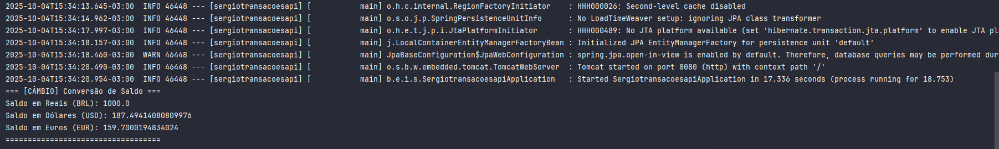
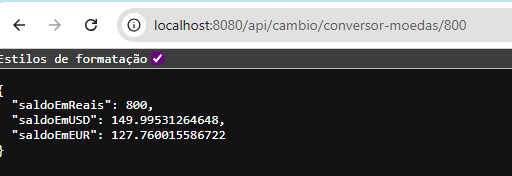
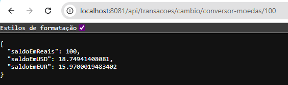
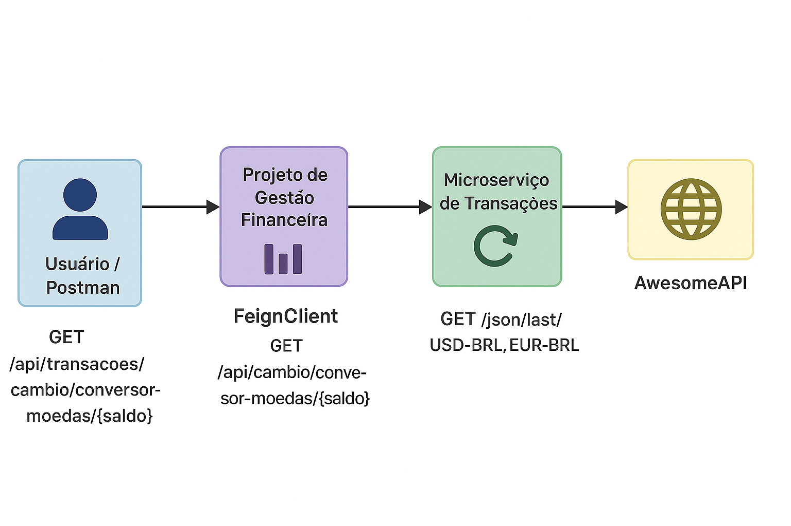

## 🔗 Feature 1: Desafio TDD

Este projeto representa a evolução da **API de Transações**, focando na implementação de **novas regras de negócio para gerenciamento financeiro**, utilizando o **Desenvolvimento Orientado a Testes (TDD - Test-Driven Development)** e a integração com **APIs externas**.

---

## 🎯 Requisito Principal: Aplicação Rigorosa do TDD

O desenvolvimento da classe principal de lógica de negócio (`TransacaoService`) foi guiado pelo ciclo **Red-Green-Refactor (RGR)**, garantindo que **cada funcionalidade fosse precedida por um teste unitário falhando** antes de ser implementada.

A comprovação da prática de TDD pode ser observada diretamente na análise do histórico de commits (`git log`).

---

## ⚙️ 1. FASE DE SETUP: DEPENDÊNCIAS DE DOMÍNIO

As classes de modelo (`Transacao`, `Conta`, `TipoTransacao`, etc.) foram criadas inicialmente para satisfazer as dependências do `TransacaoService` e dos testes unitários.

| Commit # | Ação  | Foco do Desenvolvimento |
|-----------|--------|--------------------------|
| **Commit 1** | 🏗️ SETUP | Adição das entidades de domínio (`Transacao.java`, `Conta.java`) e do enum `TipoTransacao.java`, estabelecendo a base para o serviço. |

---

## 🔁 2. CICLO TDD 1: REGISTRO DE RECEITA

Implementa a regra de negócio para **adicionar valores de RECEITA ao saldo da conta**, garantindo que o valor da transação seja **positivo**.

| Commit # | Ação | Mensagem do Commit | Foco do Código |
|-----------|------|--------------------|----------------|
| **Commit 2** | 🔴 RED | `RED: TransacaoService - Testa sucesso no registro de RECEITA.` | Adição do teste de sucesso para RECEITA no `TransacaoServiceTest.java`. (Teste falha, pois a lógica ainda não existe). |
| **Commit 3** | 🟢 GREEN | `GREEN: TransacaoService - Implementa lógica de RECEITA e validação mínima de valor > 0.` | Implementação do `switch case RECEITA` e do método `validarValor()` no `TransacaoService.java`. (Teste passa). |
| **Commit 4** | 🔴 RED | `RED: TransacaoService - Testa exceção para valor de transação negativo/zero.` | Adição de teste para validar falha com valor negativo (`naoDevePermitirValorNegativo`) no `TransacaoServiceTest.java`. |

---

## 💸 3. CICLO TDD 2: REGISTRO DE DESPESA

Implementa a regra de negócio para **subtrair valores de DESPESA**, incluindo a **checagem de saldo insuficiente**.

| Commit # | Ação | Mensagem do Commit | Foco do Código |
|-----------|------|--------------------|----------------|
| **Commit 5** | 🔴 RED | `RED: TransacaoService - Testa DESPESA e checagem de saldo insuficiente.` | Adição dos testes de sucesso e falha de saldo insuficiente no `TransacaoServiceTest.java`. |
| **Commit 6** | 🟢 GREEN | `GREEN: TransacaoService - Implementa lógica de DESPESA e regra de saldo insuficiente.` | Implementação do `switch case DESPESA` e do método `registrarDespesa()` (com checagem de saldo) no `TransacaoService.java`. (Testes passam). |

---

## 🔁 4. CICLO TDD 3: TRANSFERÊNCIA ENTRE CONTAS

Implementa a regra de negócio para **transferência de valores entre duas contas**, realizando crédito e débito de forma consistente.

| Commit # | Ação | Mensagem do Commit | Foco do Código |
|-----------|------|--------------------|----------------|
| **Commit 7** | 🔴 RED | `RED: TransacaoService - Testa transferência de valores entre contas.` | Adição do teste de sucesso para `transferir()` no `TransacaoServiceTest.java`. |
| **Commit 8** | 🟢 GREEN | `GREEN: TransacaoService - Implementa a lógica de TRANSFERÊNCIA.` | Implementação do método `transferir()`, cobrindo regras de crédito/débito e verificação de saldo. (Testes passam). |

---

## 🧰 Tecnologias Utilizadas

| Categoria | Ferramenta |
|------------|-------------|
| **Linguagem** | Java 17 |
| **Framework** | Spring Boot |
| **Testes** | JUnit 5 |
| **Metodologia** | TDD (Test-Driven Development) |

---

## 🧪 Estrutura de Testes

  
Cada regra foi validada isoladamente antes de ser integrada ao código principal.

---

## 📊 Histórico de Desenvolvimento

Para comprovar o processo de TDD, va até a branch main e utilize o comando:

```bash
git log --oneline
```


## 🔗 Feature 2: Integração e orquestração de dados com APIs externas
- O **Microserviço de Transacao (Feature 2)** fornece dados de conversão de moedas em tempo real.
- O **Projeto de Gestão Financeira (disciplina anterior)** consome esses dados via **Spring Cloud OpenFeign** e os utiliza como parte de suas funcionalidades.

📂 **Repositório do Projeto da Disciplina Anterior (consumidor):**  
👉 [https://github.com/sergiodiogoti/api-gestao-financeira](https://github.com/sergiodiogoti/api-gestao-financeira)

---

### ⚙️ Passo a passo para execução

1. **Suba o microserviço de transacao onde contém o endpoint que será consumido pelo outro serviço:**
   ```bash
   mvn spring-boot:run

- Ao rodar a aplicação é possivel observar o log que demostra que foi criado um loader para logar as conversões de moeda de reais para USD e EURO
  

- Porta padrão: 8080
- Endpoint principal:
GET http://localhost:8080/api/cambio/conversor-moedas/{saldo}
 
- Ao chamar o endpoint acima é feito uma requisição atraves do FeignClient para uma api-externa:
GET https://economia.awesomeapi.com.br/json/last/USD-BRL,EUR-BRL

- Exemplo de resposta:
```json

{
  "USDBRL": {
    "code": "USD",
    "codein": "BRL",
    "name": "Dólar Americano/Real Brasileiro",
    "high": "5.3601",
    "low": "5.31771",
    "varBid": "-0.0046",
    "pctChange": "-0.086172",
    "bid": "5.3335",
    "ask": "5.3435",
    "timestamp": "1759526951",
    "create_date": "2025-10-03 18:29:11"
  },
  "EURBRL": {
    "code": "EUR",
    "codein": "BRL",
    "name": "Euro/Real Brasileiro",
    "high": "6.28931",
    "low": "6.2422",
    "varBid": "0.011741",
    "pctChange": "0.187856",
    "bid": "6.26174",
    "ask": "6.27746",
    "timestamp": "1759525494",
    "create_date": "2025-10-03 18:04:54"
  }
}
```
Apos a resposta da awesomeapi, o serviço de transacoes cria uma regra de negocio para converter o saldo da conta em Reais para USD e EURO, e o retorno da aplicação fica assim:


2. **Suba o projeto de Gestão Financeira (disciplina anterior):**
   ```bash
   mvn spring-boot:run
- Porta definida: 8081

- Endpoint de consumo:
  GET http://localhost:8081/api/transacoes/cambio/conversor-moedas/{saldo}
  

3. **Teste a comunicação:**
- Primeiro, chame o microserviço de transaçoes diretamente (8080).
- Depois, chame o projeto de gestão (8081) e veja que ele retorna as mesmas informações, mas agora integradas ao seu domínio.

4. **Ilustração do Fluxo:**
 
